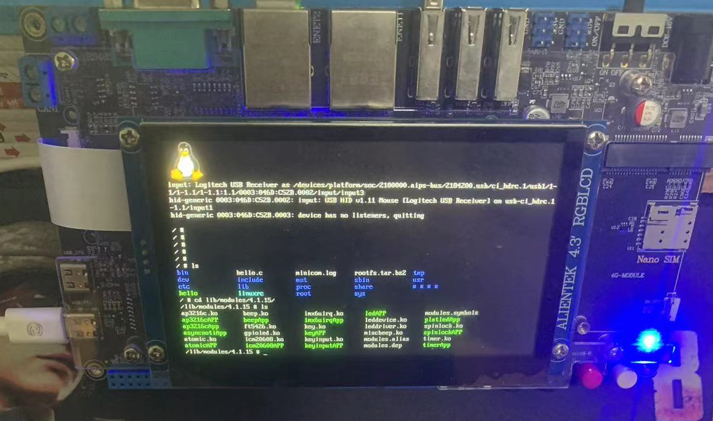

# Linux-Driver

1. 字符设备驱动
    
    1. led灯

    2. 蜂鸣器

    3. 按键

    4. input子系统

    5. i2c

    6. spi

    7. lcd触摸屏

2. 块设备驱动

    1. 模拟硬盘

3. 其它

    1. 设备树

    2. gpio

    3. 定时器

    4. 中断

    5. 互斥锁，信号量